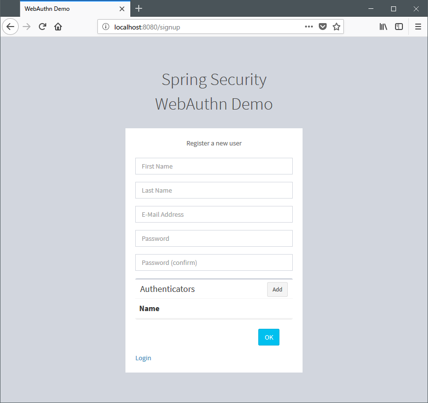
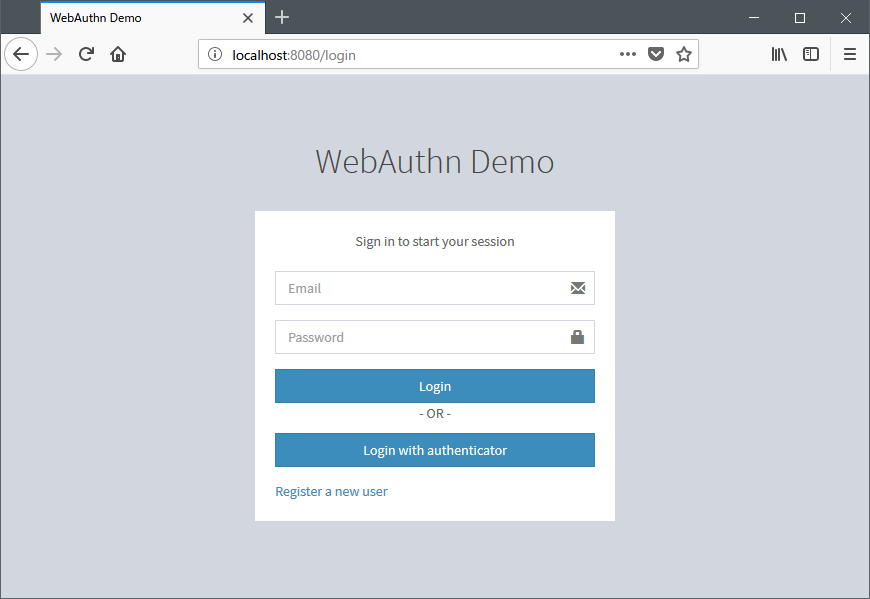
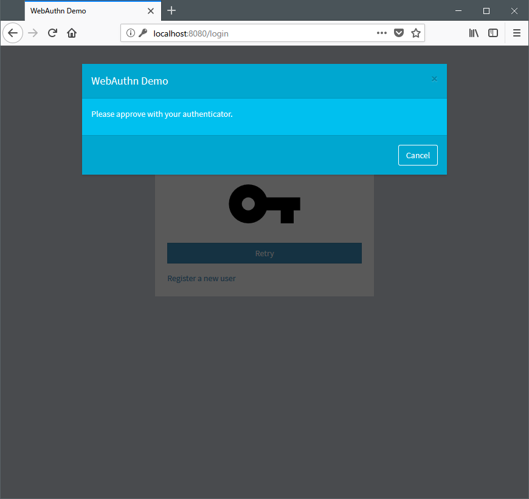

[quick-start]
== Quick start

=== Supported browsers

As of March 2018, Firefox Nightly is the only supported browser.
You need to enable the flags `security.webauthn.webauthn` and `security.webauthn.webauthn_enable_usbtoken`
in the configuration editor (`about:config` page) to use FIDO-U2F compliant authenticator.

=== Sample application execution

Sample application can be executed by following command.

```
./gradlew spring-security-webauthn-sample:bootRun
```

=== User and authenticator registration



Signup page can be accessed with `http://localhost:8080/signup`.
User and authenticator can be registered in the signup page.
Currently, FIDO-U2F compliant authenticators are supported.

=== User authentication



Login page can be accessed with `http://localhost:/8080/login`.
If you have authenticator without user verification functionality, fill your username and password, push "login" button,
then authenticator login page asking authenticator will be shown after verifying the password as a first authentication factor.



When a dialog for authentication is opened, acknowledge the authentication with your authenticator.

If you use authenticator with user verification feature, push "login with authenticator" button in login page.
Then the dialog asking authenticator opens, approve the authentication with your authenticator.

If password authentication is permitted for your account, you may login by filling username and password and pushing "login" button.
