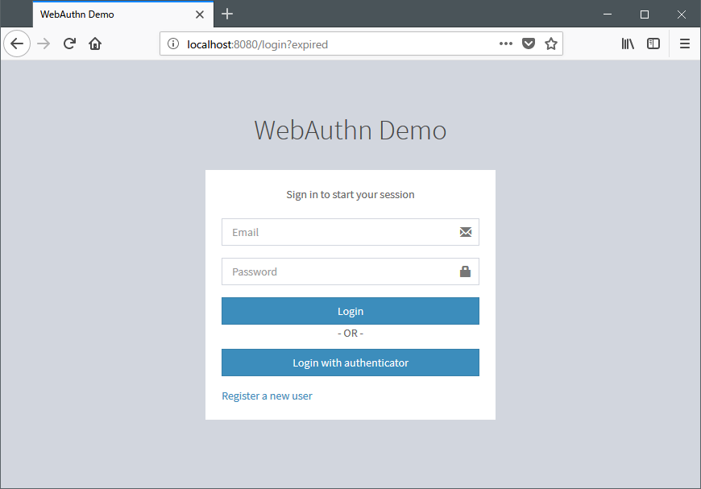

[quick-start]
== クイックスタート

=== サポートするブラウザ

2018年3月現在、Firefox Nightlyがサポートされる唯一のブラウザです。
Firefox Nightlyでは、設定エディタ（ `about:config` ページ）で `security.webauthn.webauthn` と `security.webauthn.webauthn_enable_usbtoken` フラグを
有効化することでFIDO-U2Fの認証デバイスを使用することが出来ます。

=== サンプルアプリケーションの実行

サンプルアプリケーションは以下のコマンドで実行することが出来ます。

```
./gradlew spring-security-webauthn-sample:bootRun
```

=== ユーザーおよび認証デバイスの登録

image::images/signup.png[サインアップ画面]

サインアップ画面は、 `http://localhost:8080/signup` でアクセスすることが出来ます。
サインアップ画面では、ユーザーと認証デバイスの登録を行うことが出来ます。
認証デバイスとしては、現在、FIDO-U2F準拠のデバイスがサポートされています。

=== ユーザー認証



ログイン画面は、 `http://localhost:/8080/login` でアクセスすることが出来ます。
ユーザー検証機能を持たない認証デバイスをご利用の場合は、ユーザー名とパスワードを入力し、「ログイン」ボタンを押下すると、
パスワードを第一認証要素として認証した後、第二認証要素として認証デバイスを用いた認証を求める、認証デバイスログイン画面が開きます。

image::images/authenticatorLogin.png[認証デバイスログイン画面]

認証を求めるダイアログが開いたら、認証デバイスを操作し、認証を完了してください。

ユーザー検証機能を備えた認証デバイスをご利用の場合は、ログイン画面で「認証デバイスでログイン」ボタンを押下すると、
認証デバイスを用いた認証を求めるダイアログが開きます。認証デバイスを操作し、認証を完了してください。

なお、パスワード認証を許可したユーザーの場合は、ログイン画面でユーザー名とパスワードを入力し、
「ログイン」ボタンを押下するだけでログインすることが出来ます。

